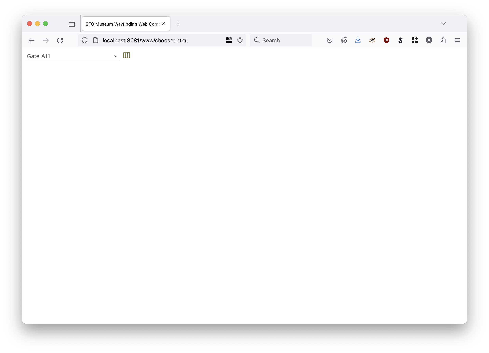
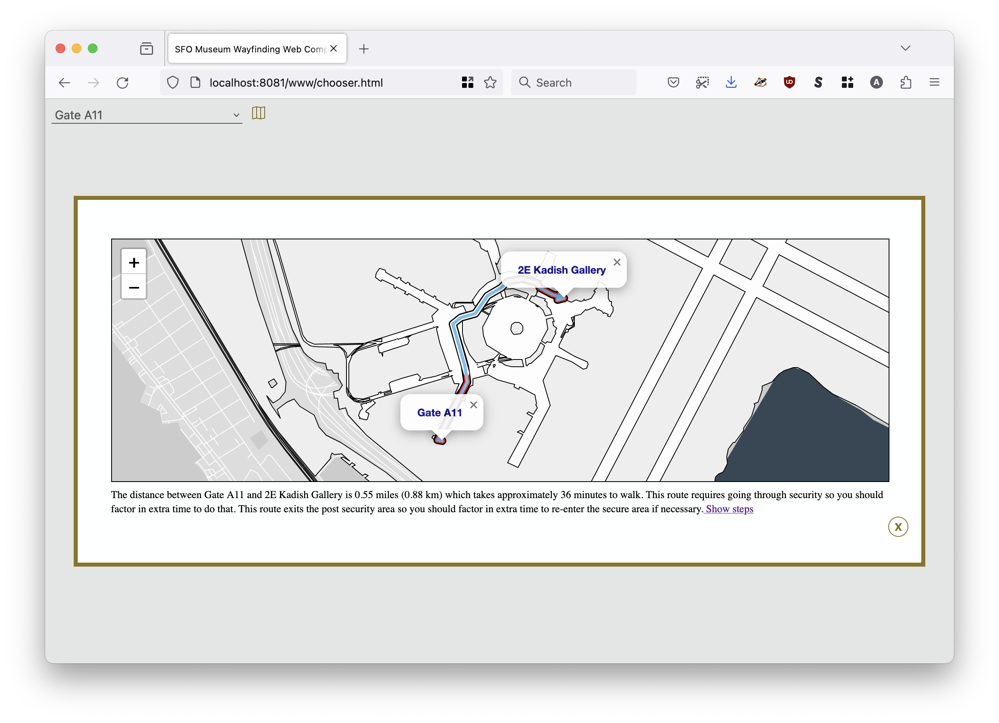
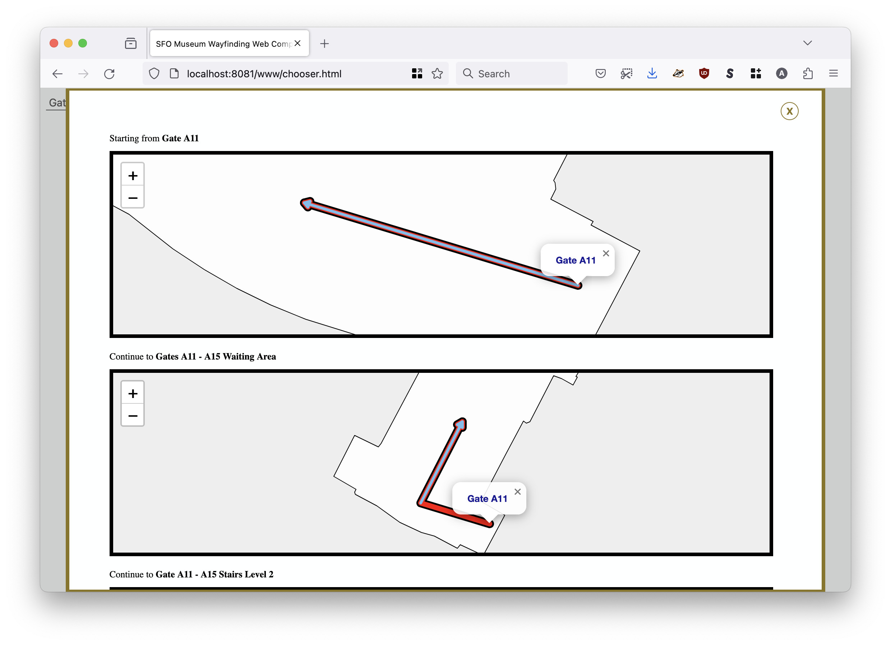
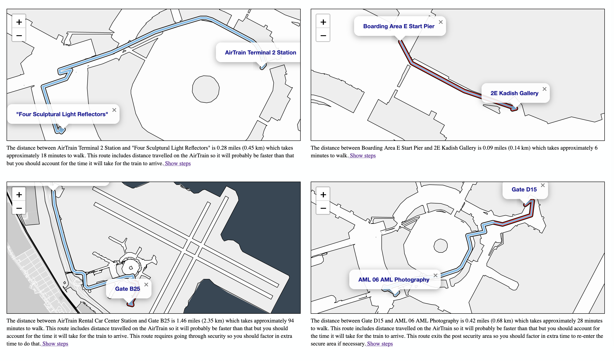

# webcomponent-sfomuseum-wayfinding

Custom Web Components for the SFO Museum Wayfinding system.

## Important

As of this writing these are SFO Museum specific Web Components. They are not generic or abstract elements to use in any other environment. This code is being made public in the spirit of generousity and as an example of how we approach the practice of developing Web Components for our needs.

## Documentation

Documentation is incomplete at this time. Consult the [www](www) folder for working examples.

Source files for the Web Components, and related CSS, are stored in the [src](src) folder. External libraries are kept in the [lib](lib) folder. Bundled distribution files are kept in the [dist](dist) folder and generated using the `bundle` Makefile target (which depends on [minify](https://github.com/tdewolff/minify) being installed).

```
$> make bundle
minify -b \
		-o dist/sfomuseum.wayfinding.webcomponent.bundle.js \
		lib/leaflet.js \
		lib/leaflet.geometryutil.js \
		lib/leaflet-arrowheads.js \
		lib/protomaps.js \
		lib/protomaps-leaflet.min.js \
		lib/wasm_exec.js \
		lib/sfomuseum.*.js \
		src/sfomuseum.wayfinding.chooser.js \
		src/sfomuseum.wayfinding.map.js
(32.714375ms, 948 kB, 753 kB,  79.4%,  29 MB/s) - (lib/leaflet.js + lib/leaflet.geometryutil.js + lib/leaflet-arrowheads.js + lib/protomaps.js + lib/protomaps-leaflet.min.js + lib/wasm_exec.js + lib/sfomuseum.maps.campus.js + lib/sfomuseum.maps.data.js + lib/sfomuseum.maps.protomaps.js + lib/sfomuseum.wasm.js + lib/sfomuseum.wayfinding.extensions.js + lib/sfomuseum.wayfinding.maps.js + lib/sfomuseum.wayfinding.route.js + lib/sfomuseum.wayfinding.steps.js + src/sfomuseum.wayfinding.chooser.js + src/sfomuseum.wayfinding.map.js) to dist/sfomuseum.wayfinding.webcomponent.bundle.js
minify -b \
		-o dist/sfomuseum.wayfinding.webcomponent.bundle.css \
		lib/leaflet.css \
		lib/sfomuseum.wayfinding.steps.css \
		src/sfomuseum.wayfinding.*.css
(    542µs,  19 kB,  14 kB,  75.1%,  35 MB/s) - (lib/leaflet.css + lib/sfomuseum.wayfinding.steps.css + src/sfomuseum.wayfinding.chooser.css + src/sfomuseum.wayfinding.leaflet.css + src/sfomuseum.wayfinding.map.css) to dist/sfomuseum.wayfinding.webcomponent.bundle.css
```

## sfomuseum-wayfinding-chooser

An inline wayfinding select menu to choose and display a route to a fixed waypoint from a list of options. Once selected the route will be displayed in a (modal) `dialog` element that itself contains a new `<sfomuseum-wayfinding-map>` Web Component.

### Attributes

| Name | Value | Required | Notes |
| --- | --- | --- | --- |
| destination | A comma-separated list of valid waypoint IDs | yes | |
| show-steps | | no | Display a link to open a modal dialog with step-by-step maps |
| disable-scroll | | no | Display the Leaflet map scroll wheel listener |
| arrowheads | | no | Display arrowheads at the end (front) of a route |
| api-endpoint | A valid URI | yes | A valid URI to a SFO Museum Wayfinding API endpoint or a `wasm://?uri={URI}` string pointing to a `sfomuseum_route.wasm` binary

### Example

```
<template id="sfomuseum-wayfinding-chooser-template">
    <link rel="stylesheet" type="text/css" href="../src/sfomuseum.wayfinding.chooser.css" />
</template>

<template id="sfomuseum-wayfinding-map-template">
    <link rel="stylesheet" type="text/css" href="../dist/sfomuseum.wayfinding.webcomponent.bundle.css" />	    
    <style type="text/css">
     .wayfinding-map-wrapper {
	     width: 95%;
	     margin:1rem;
	     margin: 0 auto;
     }
     .wayfinding-map {
	     height: 300px;
	     width: 100%;		     
	     border:solid thin;
     }
     .wayfinding-map-caption {
	     font-size:small;
	     margin-top: .5rem;
	     line-height: 1.1rem;
     }
    </style>
</template>

<sfomuseum-wayfinding-chooser destination="1763594985" show-steps disable-scroll arrowheads api-endpoint="http://localhost:8080/wayfinding/api"></sfomuseum-wayfinding-chooser>

<script type="text/javascript" src="../dist/sfomuseum.wayfinding.webcomponent.bundle.js"></script>        
```







## sfomuseum-wayfinding-map

An inline (Leaflet/Protomaps) map depicting the route between two waypoints.

### Attributes

| Name | Value | Required | Notes |
| --- | --- | --- | --- |
| to | A comma-separated list of valid waypoint IDs | yes | |
| from | A valid waypoint ID | yes | |
| show-steps | | no | Display a link to open a modal dialog with step-by-step maps |
| disable-scroll | | no | Display the Leaflet map scroll wheel listener |
| arrowheads | | no | Display arrowheads at the end (front) of a route |
| api-endpoint | A valid URI | yes | A valid URI to a SFO Museum Wayfinding API endpoint or a `wasm://?uri={URI}` string pointing to a `sfomuseum_route.wasm` binary

### Example

```
<template id="sfomuseum-wayfinding-map-template">
    <link rel="stylesheet" type="text/css" href="../dist/sfomuseum.wayfinding.webcomponent.bundle.css" />
    <style type="text/css">
     .wayfinding-map-wrapper {
	     width: 100%;
	     margin:1rem;
     }
     .wayfinding-map {
	     height: 300px;
	     width: 100%;		     
	     border:solid thin;
     }
     .wayfinding-map-caption {
	     font-size:small;
	     margin-top: .5rem;
	     line-height: 1.1rem;
     }
    </style>
</template>

<sfomuseum-wayfinding-map from="1796982269" to="1745903711" show-steps disable-scroll arrowheads api-endpoint="http://localhost:8080/wayfinding/api"></sfomuseum-wayfinding-map>
<sfomuseum-wayfinding-map from="1796889497" to="1763594985" show-steps disable-scroll arrowheads api-endpoint="http://localhost:8080/wayfinding/api"></sfomuseum-wayfinding-map>
<sfomuseum-wayfinding-map from="1796982281" to="1763588201" show-steps disable-scroll arrowheads api-endpoint="http://localhost:8080/wayfinding/api"></sfomuseum-wayfinding-map>
<sfomuseum-wayfinding-map from="1763588159" to="1729813735" show-steps disable-scroll arrowheads api-endpoint="wasm://?uri=../lib/sfomuseum_route.wasm"></sfomuseum-wayfinding-map>

<script type="text/javascript" src="../dist/sfomuseum.wayfinding.webcomponent.bundle.js"></script>
```



